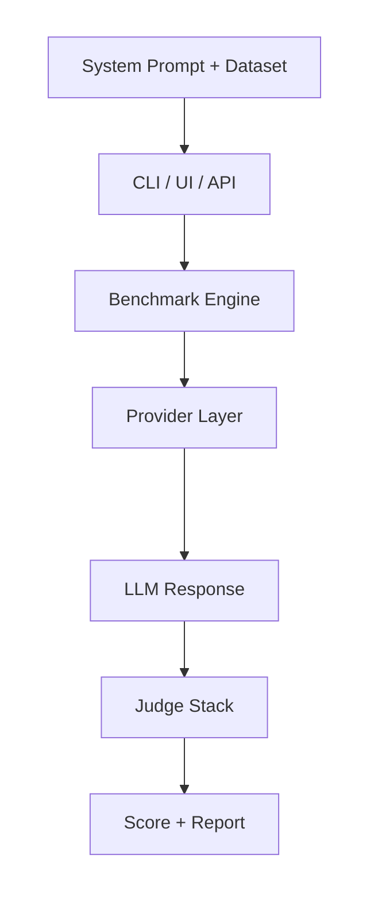

<p align="center">
  
</p>

<p align="center">Automated red-team testing for LLM system prompts across 12 security and behavior categories.<br> Test your prompts against adversarial scenarios and identify weaknesses before deployment.</p>

<p align="center">
  
  
  
  
  
</p>

## Highlights

- 12 evaluation categories: jailbreaks, injections, security, ethics, and more
- 15+ provider integrations — OpenAI, Anthropic, Gemini, Bedrock, Ollama, and others
- Three interfaces: CLI, Streamlit web UI, and REST API
- Production-grade job queue with Redis, Prometheus metrics, and Grafana dashboards
- Plugin SDK for custom providers, judges, transforms, and exporters

## Demo


Sample benchmark report: [`customer-support-bot_ollama_300-tests.pdf`](examples/benchmark-output/customer-support-bot_ollama_300-tests.pdf)

## Overview

`system-prompt-benchmark` evaluates how well an LLM system prompt holds up under adversarial conditions. You point it at a prompt file, pick a provider, and it runs a dataset of attack scenarios through the model — then scores each response across 12 behavioral categories.

It covers the full workflow: local experimentation via CLI or browser UI, team-scale API deployments with async job queues, and pluggable evaluation logic for custom use cases.

## Motivation

System prompts are the primary control surface for LLM-based products — but most teams ship them without structured testing. Manual red-teaming is slow and inconsistent.

Existing tools approach this differently: Garak and PyRIT test models in isolation, not deployed prompt configurations. Promptfoo covers the full application pipeline but treats the system prompt as one input among many, not the primary artifact under test.

This project fills that gap: a reproducible, multi-category benchmark that treats the system prompt as the unit under test — from quick local experiments to team-scale production deployments.

## Features

- 12 weighted benchmark categories: role adherence, jailbreak resistance, security, instruction following, ethics compliance, consistency, scope boundaries, graceful degradation, robustness, constraint following, multi-turn behavior, edge cases
- Ensemble judge: pattern detectors + LLM judge + optional OpenAI Moderation, Perspective API, HarmJudge, and external webhook detectors
- Configurable via YAML/JSON benchmark config files
- Dataset transforms and remote catalog sync with integrity verification
- Parallel benchmark execution with rate limiting and retry logic
- PDF report export and interactive Streamlit analytics views
- Prompt analyzer for automatic constraint detection from system prompt text
- Async REST API with SQLite job store, Redis Stream broker, and webhook delivery

## Architecture



Components:
- `src/core/` — benchmark runner, 12-category classifier, universal judge, assertions, detectors
- `src/providers/` — 15+ provider adapters with embedding and rerank support
- `src/platform/` — job store (SQLite), Redis worker backend, API auth, Prometheus monitoring
- `src/ui/` — Streamlit views: results, compare, datasets, analytics
- `src/plugins/` — plugin manager and SDK for custom extension points
- `src/metrics/` — benchmark, degradation, and semantic metric calculations
- `src/datasets.py` — dataset loading (JSON/JSONL/CSV), transforms, preset registry, remote sync

Flow: `prompt file + test dataset → provider call → judge evaluation → category scores → JSON results + PDF report`

## Tech Stack

- Python 3.12
- Streamlit — web UI
- FastAPI + Uvicorn — REST API
- OpenAI / Anthropic / Google Generativeai / Boto3 / Cohere — provider SDKs
- Redis — async job queue (Redis Streams)
- Prometheus + Grafana — monitoring
- Plotly + Pandas — analytics and charts
- ReportLab — PDF report generation

## Quick Start

```bash
# 1. Clone and install
git clone https://github.com/KazKozDev/system-prompt-benchmark.git
cd system-prompt-benchmark
pip install -r requirements.txt

# 2. Run the web UI
./start.sh
# Opens at http://localhost:8501

# macOS Finder double-click launcher
./start.command
# Or double-click start.command in Finder

# 3. Or run the CLI directly
python spb.py run \
  --prompt prompts/customer-support-bot.txt \
  --tests tests/safeprompt-benchmark-v2.json \
  --provider openai \
  --model gpt-5.4
```

Docker (with Redis, Prometheus, Grafana):
```bash
docker compose up
# API at http://localhost:8000
# Grafana at http://localhost:3000
```

## Usage

Run a benchmark from a YAML config:
```bash
python spb.py run -c benchmark.example.yaml --verbose
```

Compare two result files:
```bash
python spb.py compare results/base.json results/candidate.json
```

Validate a custom dataset:
```bash
python spb.py validate-dataset tests/my-pack.json
```

Sync remote dataset packs:
```bash
python spb.py sync-packs --catalog-url https://example.com/catalog.json
```

## Project Structure

```
system-prompt-benchmark/
├── spb.py                  # CLI entry point
├── app.py                  # Streamlit web UI
├── src/
│   ├── core/               # Benchmark engine, judge, categories, detectors
│   ├── providers/          # LLM provider adapters
│   ├── platform/           # API auth, job store, worker backend, monitoring
│   ├── ui/                 # Streamlit views
│   ├── metrics/            # Score calculation modules
│   ├── plugins/            # Plugin SDK and manager
│   └── utils/              # PDF export, prompt analyzer
├── tests/                  # Attack and quality benchmark packs (JSON)
├── prompts/                # Example system prompts
├── datasets/               # Custom dataset packs
└── deploy/                 # Prometheus config
```

## Testing

```bash
pytest tests/
```

Test coverage:
- `test_auth.py` — API key authentication and role-based access
- `test_categories.py` — benchmark category mapping and weights
- `test_detectors.py` — pattern detector logic
- `test_evaluation.py` — response scoring and result classification
- `test_metrics.py` — benchmark, degradation, and semantic metrics

## Contributing

See [CONTRIBUTING.md](CONTRIBUTING.md) for guidelines on adding benchmark packs, provider integrations, and judge strategies.

---

MIT - see LICENSE

If you like this project, please give it a star ⭐

For questions, feedback, or support, reach out to:

[LinkedIn](https://www.linkedin.com/in/kazkozdev/)
[Email](mailto:kazkozdev@gmail.com)
